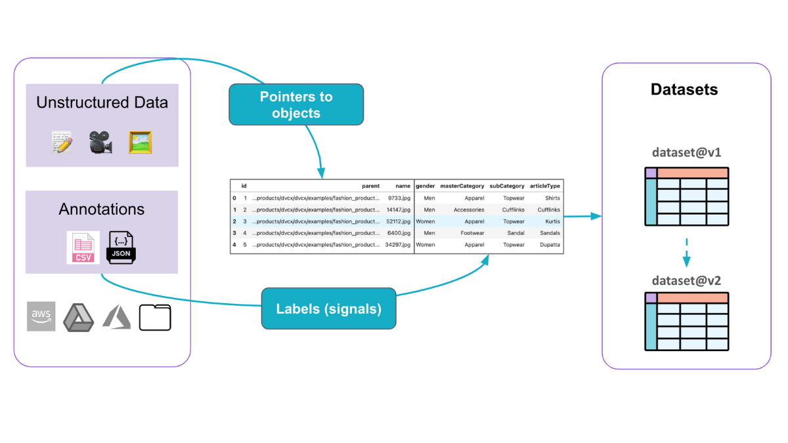

# Fashion Products Images 👗👔

DataChain is a powerful tool for managing datasets and ML workflows. This tutorial explores how DataChain helps Computer Vision projects:

- 🗂️ Manage and version datasets and annotations effectively.
- 🔍 Handle large-scale operations, applying complex filters and transformations to millions of data entries.
- 🎨 Generating and managing embeddings
- ⏰ Save time and resources by avoiding redundant computations for previously processed samples.
- 🌊 Directly stream curated data into PyTorch for training and inference.



## 📥 Download data

The Fashion Product Images (Small) dataset for this example was loaded from [kaggle.com](https://www.kaggle.com/datasets/paramaggarwal/fashion-product-images-small/data) contributed by Param Aggarwal.

Download data from [kaggle](https://www.kaggle.com/datasets/paramaggarwal/fashion-product-images-small) to the `data` directory.

```bash
data/
├──images
├── styles.csv
```

## 🛠️ Install

```bash
python -m venv .venv
source .venv/bin/activate
pip install -r requirements.txt
```

## 🚀 Run Jupyter Notebooks

The tutorial is available in Jupyter Notebooks. Start Jupyter Notebook server and follow the instructions.

```bash
jupyter notebook
```

## 🏃‍♂️ Run scripts (optional)

DataChain provides a CLI tool to run Python scripts. There are a few example scripts in the `scripts` directory similar to examples in Jupyter Notebooks.

Use `datachain query` CLI command to run scripts.

```bash
datachain query scripts/1-quick-start.py
```

## 🤝 Get Involved

We'd love to have you join our growing community of DataChain users and contributors! Here's how you can get involved:

- ⭐ Give us a star on [GitHub](https://github.com/iterative/dvcx) to show your support
- 🌐 Visit the [dvc.ai website](https://dvc.ai/) to learn more about our products and services
- 📞 Contact us to discuss on scaling 🚀 DataChain for your project!
- 🙌 Follow us on [LinkedIn](https://www.linkedin.com/company/dvc-ai/) and [Twitter](https://x.com/DVCorg) for the latest updates and insights

Thanks for choosing DataChain, and happy coding! 😄
